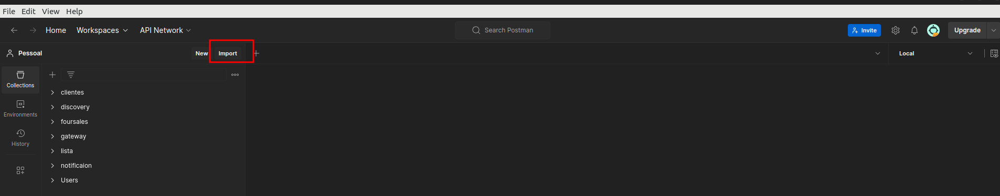
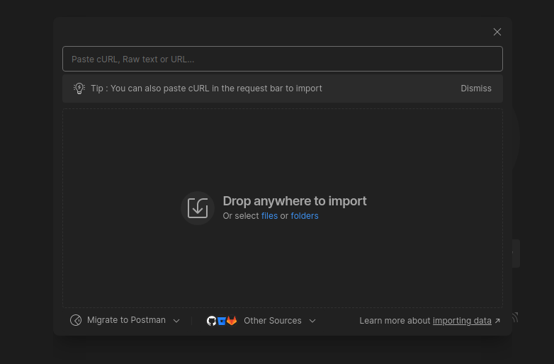
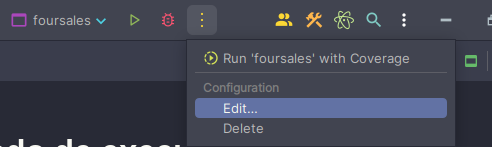
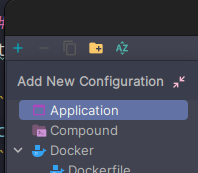
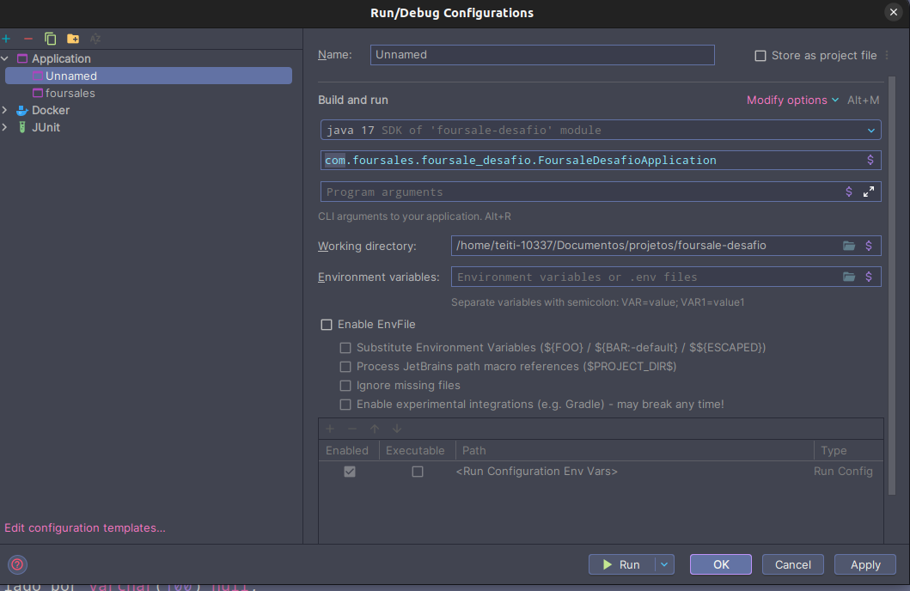

# Desafio Técnico - Desenvolvedor Pleno

## Passo a passo para execução

### Dump banco de dados

O arquivo se encontra na pasta `docker`

### Execução de endpoints

Decidi criar a estrutura pelo postman e compartilhar os endpoints, environments estão na pasta `enviroments_postman`

### Modo de exportação

Clique em importar


Selecione arquivo


### Modo de execução do projeto

#### Docker

Optando por utilizar o docker, basta entrar no arquivo `docker/docker-compose.yml` e executar o container da imagem do
mysql com o comando abaixo:

```bash
docker compose up -d mysql 
```

Com isso, temos a conexão do banco disponivel, então iremos executar o projeto

#### Intelij
<br/>

Configuration



Criando application
<br/>


Configurando application e executando


Assim deve iniciar o projeto corretamente

## Usuarios cadastrados

ADMIN -

``` 
email: galasdalas1@gmail.com
senha: 1234
```

USER -

``` 
email: galasdalas2@gmail.com
senha: 1234
```